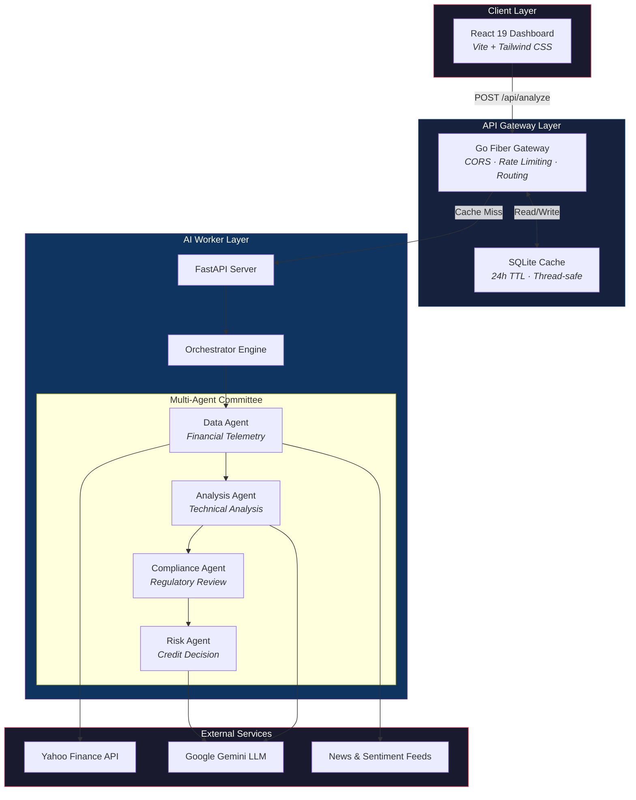
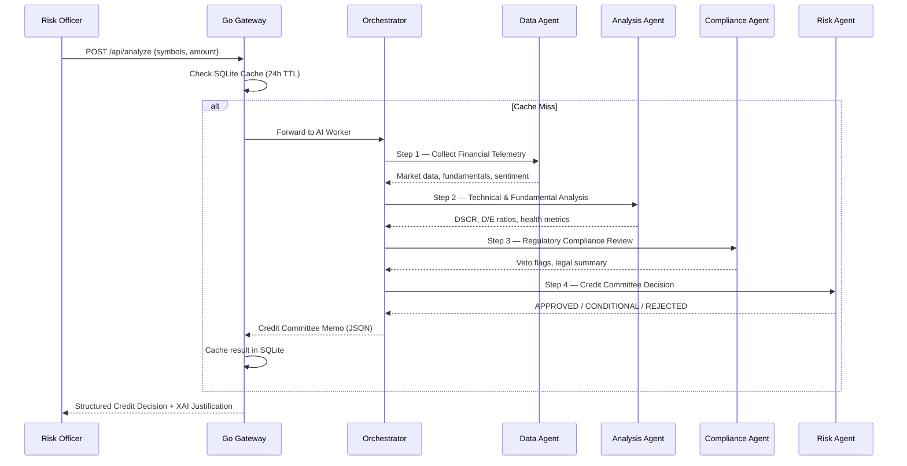
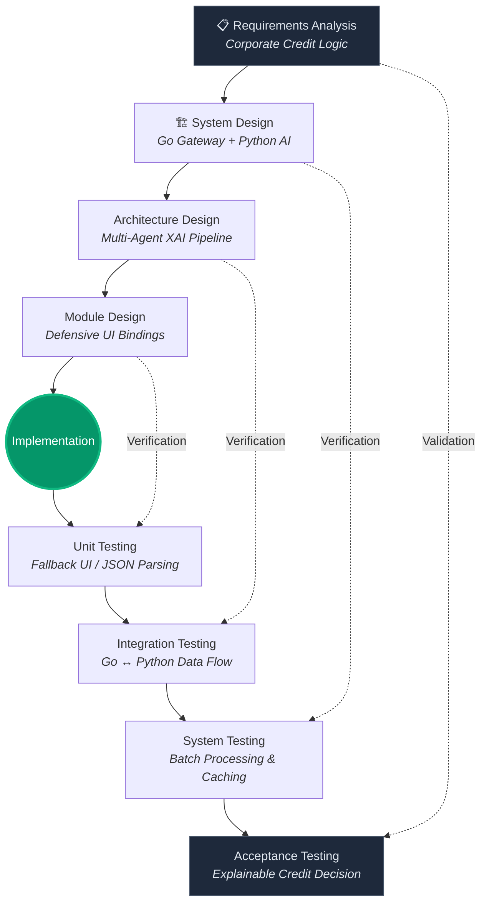

<div align="center">

<br/>


# CoreMine Risk

### AI-Powered Corporate Credit Underwriting Terminal

*Replacing black-box financial decisions with a dialectical Multi-Agent XAI Consensus Engine.*

<br/>

[](https://btk-hackaton-2026-elitedevs.netlify.app/)
[](https://opensource.org/licenses/MIT)
[](https://www.btk.gov.tr/)

[](https://go.dev/)
[](https://www.python.org/)
[](https://react.dev/)
[](https://fastapi.tiangolo.com/)
[](https://ai.google.dev/)
[](https://docs.docker.com/compose/)

<br/>

**[Live Demo](https://btk-hackathon2026-elitedevs.netlify.app/) · [Architecture](#architecture) · [Quick Start](#-quick-start) · [API Docs](#-api-reference) · [Contributing](#-contributing)**

<br/>

---

</div>

## The Problem

> A bank **cannot legally** deny a $50M loan by saying *"The AI said no."*

Current financial AI tools either summarize PDFs or predict stock prices. They catastrophically fail in **institutional lending** because they lack one critical component: **Explainability (XAI)**.

Regulatory frameworks like **Basel III**, **SR 11-7**, and **EU AI Act** demand that every automated credit decision comes with a complete, auditable justification trail. Black-box models are not just risky — they are **non-compliant**.

##  The Solution

**CoreMine Risk** is an enterprise-grade decision support system that orchestrates specialized AI agents to simulate a **Corporate Credit Committee**. Instead of a single opaque model, it forces distinct AI personas into adversarial debate — producing the exact mathematical and logical justification required by financial compliance law.

<table>
<tr>
<td width="50%">

### Before CoreMine
- ❌ Manual credit underwriting takes **3+ weeks**
- ❌ Black-box AI decisions fail compliance audits
- ❌ No audit trail for regulatory examination
- ❌ Inconsistent risk assessment across analysts
- ❌ Zero explainability for stakeholders

</td>
<td width="50%">

### After CoreMine
- ✅ Automated assessment in **under 15 seconds**
- ✅ Full XAI transparency with dialectical debate logs
- ✅ Complete audit trail for every decision
- ✅ Consistent, multi-agent consensus-driven verdicts
- ✅ Committee-level justification with agent vote records

</td>
</tr>
</table>

---

##  Key Features

<table>
<tr>
<td align="center" width="33%">
<h3> Multi-Agent Dialectics</h3>
<p>Decisions forged through deliberate conflict between a <strong>Risk Auditor</strong>, <strong>Client Advocate</strong>, <strong>Data Agent</strong>, and <strong>Compliance Agent</strong>.</p>
</td>
<td align="center" width="33%">
<h3> What-If Simulation</h3>
<p>Real-time stress-testing of custom loan amounts. The system dynamically recalculates risk based on requested debt capacity.</p>
</td>
<td align="center" width="33%">
<h3> Batch Processing</h3>
<p>Concurrent screening of multiple corporate entities for rapid portfolio-level risk assessment.</p>
</td>
</tr>
<tr>
<td align="center" width="33%">
<h3> Audit-Ready Export</h3>
<p>Native PDF credit memo and CSV dataset generation for legacy banking systems and compliance archives.</p>
</td>
<td align="center" width="33%">
<h3> High-Speed Caching</h3>
<p>SQLite-backed middleware with 24-hour TTL ensures sub-millisecond retrieval of historical analyses.</p>
</td>
<td align="center" width="33%">
<h3> Enterprise Webhooks</h3>
<p>Real-time decision broadcasting via Slack and ERP system integrations.</p>
</td>
</tr>
</table>

---

## Architecture

CoreMine Risk is built on a **distributed microservices architecture** with three independently deployable services:



### Agent Pipeline

The multi-agent system follows a **sequential dialectical process**, where each agent's output feeds into the next, culminating in a committee-level consensus decision:



---

##  Project Structure

```
coremine-risk/
│
├──  ai-worker/                    # Python AI Microservice
│   ├── agents/
│   │   ├── data_agent.py            # Financial data collection & enrichment
│   │   ├── analysis_agent.py        # Technical & fundamental analysis
│   │   ├── compliance_agent.py      # Regulatory compliance screening
│   │   └── risk_agent.py            # Credit committee decision engine
│   ├── core/
│   │   ├── orchestrator.py          # Multi-agent pipeline coordinator
│   │   ├── gemini.py                # Google Gemini LLM integration
│   │   └── config.py                # Environment & settings management
│   ├── tools/
│   │   ├── financial_data.py        # Yahoo Finance data extraction
│   │   ├── technical_analysis.py    # DSCR, D/E, coverage calculations
│   │   └── news_sentiment.py        # News feed sentiment analysis
│   ├── app.py                       # FastAPI entry point
│   ├── Dockerfile
│   └── requirements.txt
│
├──  go-gateway/                    # Go API Gateway
│   ├── cmd/api/
│   │   └── main.go                  # HTTP server bootstrap
│   ├── internal/
│   │   ├── handlers/                # Request handlers & routing
│   │   ├── services/                # Business logic layer
│   │   ├── models/                  # Data transfer objects
│   │   └── db/                      # SQLite cache layer
│   ├── Dockerfile
│   └── go.mod
│
├──  frontend/                     # React Dashboard
│   ├── src/
│   │   ├── components/
│   │   │   ├── Dashboard.jsx        # Main analysis dashboard
│   │   │   ├── BorrowerApplicationForm.jsx  # Loan application interface
│   │   │   ├── AgentReviewBoard.jsx         # XAI agent vote display
│   │   │   ├── CreditScorecard.jsx          # Visual credit scoring
│   │   │   ├── DefaultRiskAssessment.jsx    # Risk level visualization
│   │   │   ├── BatchResultsTable.jsx        # Multi-entity results grid
│   │   │   ├── TerminalLoading.jsx          # Cyberpunk loading sequence
│   │   │   └── CompanyCombobox.jsx          # Searchable entity selector
│   │   ├── api/                     # Axios interceptors & gateway bindings
│   │   ├── store/                   # Zustand state management
│   │   └── App.jsx                  # Root application component
│   ├── Dockerfile
│   └── package.json
│
├── docker-compose.yml               # Container orchestration
├── render.yaml                      # Cloud deployment config
└── README.md
```

---

##  Quick Start

### Prerequisites

| Tool | Version | Required |
|------|---------|----------|
| [Docker](https://docs.docker.com/get-docker/) | 20.10+ | ✅ |
| [Docker Compose](https://docs.docker.com/compose/) | 2.0+ | ✅ |
| [Google AI Studio Key](https://aistudio.google.com/apikey) | — | ✅ |
| [Node.js](https://nodejs.org/) | 18+ | Optional (local dev) |
| [Go](https://go.dev/) | 1.25+ | Optional (local dev) |
| [Python](https://www.python.org/) | 3.10+ | Optional (local dev) |

### Option 1: Docker (Recommended)

```bash
# 1. Clone the repository
git clone https://github.com/EyupEfeAslan2/BTK-Hackathon2026-EliteDevs.git
cd BTK-Hackathon2026-EliteDevs

# 2. Create environment file
cat > ai-worker/.env << EOF
GEMINI_API_KEY=your_google_ai_studio_key
EOF

# 3. Launch all services
docker compose up --build
```

### Option 2: Manual Setup

<details>
<summary><strong> AI Worker (Python)</strong></summary>

```bash
cd ai-worker

# Create virtual environment
python -m venv venv
source venv/bin/activate  # Linux/macOS
# venv\Scripts\activate   # Windows

# Install dependencies
pip install -r requirements.txt

# Configure environment
echo "GEMINI_API_KEY=your_key" > .env

# Start the service
uvicorn app:app --host 0.0.0.0 --port 8000 --reload
```

</details>

<details>
<summary><strong> Go Gateway</strong></summary>

```bash
cd go-gateway

# Set AI Worker URL
export AI_WORKER_URL=http://localhost:8000

# Build and run
go run cmd/api/main.go
```

</details>

<details>
<summary><strong> Frontend</strong></summary>

```bash
cd frontend

# Install dependencies
npm install

# Start development server
npm run dev
```

</details>

### Accessing the Application

| Service | URL | Description |
|---------|-----|-------------|
|  **Dashboard** | `http://localhost:5173` | React UI |
|  **API Gateway** | `http://localhost:3030` | Go API |
|  **AI Worker** | `http://localhost:8000` | Python AI Service |
|  **API Docs** | `http://localhost:8000/docs` | Swagger UI (auto-generated) |

---

## API Reference

### Analyze Entity

```http
POST /api/analyze
Content-Type: application/json
```

**Request Body:**

```json
{
  "symbols": ["AAPL"],
  "period": "1y",
  "use_crew": true,
  "requested_amount": "50"
}
```

| Field | Type | Required | Description |
|-------|------|----------|-------------|
| `symbols` | `string[]` | ✅ | Corporate ticker symbols (e.g., `["AAPL", "MSFT"]`) |
| `period` | `string` | ❌ | Analysis lookback period (default: `"1y"`) |
| `use_crew` | `boolean` | ❌ | Use CrewAI workflow vs direct orchestration |
| `requested_amount` | `string` | ❌ | Loan amount (in millions) for What-If simulation |

**Response:**

```json
{
  "committee_decision": "APPROVED",
  "default_risk_level": "LOW",
  "justification_summary": "The AI credit committee recommends APPROVAL...",
  "recommended_loan_terms": {
    "max_amount": "$50M",
    "tenor": "5 Years",
    "covenants": [
      "Maintain minimum liquidity of $250M",
      "Maintain net debt to EBITDA below 2.5x"
    ]
  },
  "agent_votes": [
    {
      "agent_name": "Data Agent",
      "vote": "APPROVED",
      "brief_reason": "Strong public-market data coverage..."
    },
    {
      "agent_name": "Risk Agent",
      "vote": "APPROVED",
      "brief_reason": "Default probability is low..."
    },
    {
      "agent_name": "Compliance Agent",
      "vote": "APPROVED",
      "brief_reason": "No blocking compliance flags..."
    }
  ],
  "raw_telemetry": { ... },
  "status": "success"
}
```

### Health Check

```http
GET /health
```

Returns `{"status": "ok"}` when the AI Worker is operational.

---

## Tech Stack

<table>
<tr>
<th>Layer</th>
<th>Technology</th>
<th>Purpose</th>
</tr>
<tr>
<td rowspan="3"><strong>Frontend</strong></td>
<td></td>
<td>Component-based UI with hooks</td>
</tr>
<tr>
<td></td>
<td>Lightning-fast build tooling & HMR</td>
</tr>
<tr>
<td></td>
<td>Lightweight state management</td>
</tr>
<tr>
<td rowspan="3"><strong>Gateway</strong></td>
<td></td>
<td>High-performance concurrent API layer</td>
</tr>
<tr>
<td></td>
<td>Express-inspired web framework</td>
</tr>
<tr>
<td></td>
<td>Persistent cache with 24h TTL</td>
</tr>
<tr>
<td rowspan="4"><strong>AI Worker</strong></td>
<td></td>
<td>Async Python API framework</td>
</tr>
<tr>
<td></td>
<td>Multi-agent orchestration framework</td>
</tr>
<tr>
<td></td>
<td>Large Language Model backbone</td>
</tr>
<tr>
<td></td>
<td>Real-time financial data extraction</td>
</tr>
<tr>
<td rowspan="2"><strong>DevOps</strong></td>
<td></td>
<td>Container orchestration</td>
</tr>
<tr>
<td> </td>
<td>Production deployment (Edge UI + Backend)</td>
</tr>
</table>

---

## Methodology

This project follows the **V-Model** Software Development Life Cycle for maximum quality assurance:



---

## Contributing

We welcome contributions! Please follow these steps:

1. **Fork** the repository
2. **Create** your feature branch (`git checkout -b feature/amazing-feature`)
3. **Commit** your changes (`git commit -m 'feat: add amazing feature'`)
4. **Push** to the branch (`git push origin feature/amazing-feature`)
5. **Open** a Pull Request

Please make sure to:
- Follow the existing code style and conventions
- Write meaningful commit messages using [Conventional Commits](https://www.conventionalcommits.org/)
- Update documentation as needed

---

<div align="center">

## Team — Elite Devs

*Developed for BTK Hackathon 2026*

| Role | Name |
|------|------|
| **Lead Backend & AI Architect** | Eyüp Efe Aslan |
| **Frontend Engineer & UI Specialist** | Ceren Aylin Balaban |

<br/>

---

<sub>

**CoreMine Risk**

</sub>

</div>